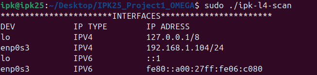
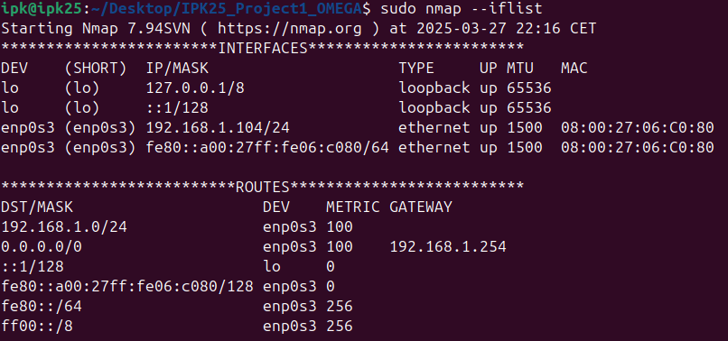
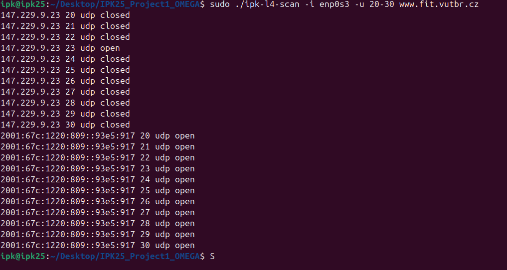
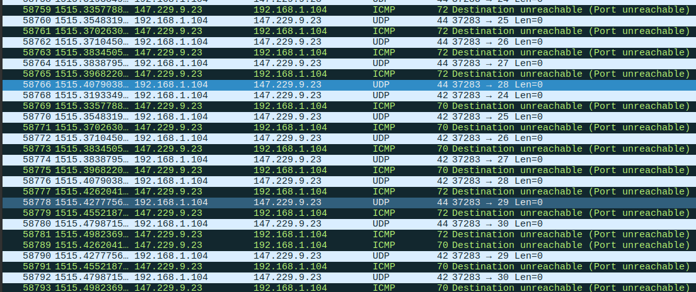
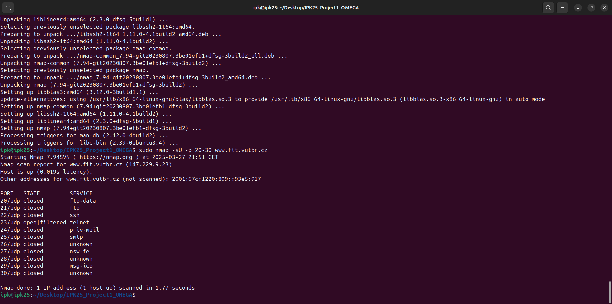
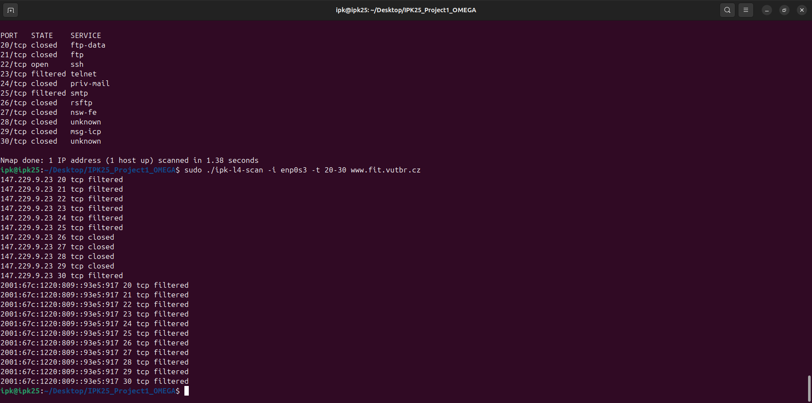
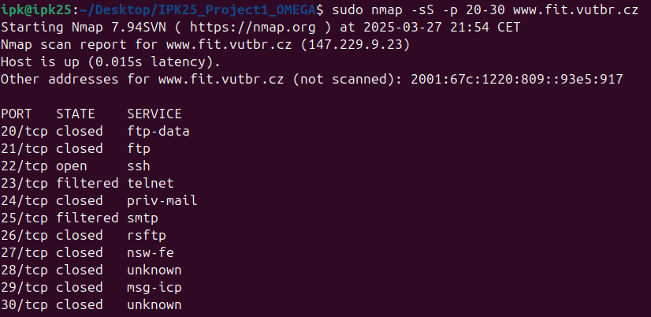

# Summary

This program is TCP and UDP network L4 scanner.
Program uses sockets to make connections to host. For TCP scanning raw sockets and for UDP datagram sockets.

## TCP Scanning

TCP scanning is done by sending SYN packet, which purpose is to synchronise sequence numbers, but in this program we will not complete the 3-way handshake. This can be only done after the host sends SYN+ACK packet. To ensure to not complete the connection, the RST packet must be sent to host. Port is then considered open.
Instead if receive RST packet, the port is closed.
If no response was received before timeout, port can be considered filtered.

## UDP Scanning

UDP is conectionless, principle of scanning is sending UDP packet, and then waiting for corresponding ICMP(V6) packet.
For the port at IPV4 adress considered closed we must receive ICMP packet with code 3 and type 3.
In case of IPV6 the port is closed if ICMPV6 packet with code 1 and type 4 is received.
If neither of these cases happens port can be considered open.

## Testing

Testing was done reference virtual machine given by authors of assigment.

### Printing of available interfaces

### UDP scanning

Program was run with command:
sudo ./ipk-l4-scan -i enp0s3 -u 20-30 www.fit.vutbr.cz

As you can see the scanning in IPV6 considers all ports open, because timeout runs out before the ICMP6 packet receive. And this packet cannot be received because corresponding.

For reference and to see if the results are correct i am using nmap:

### TCP scanning

Program was run with command:
sudo ./ipk-l4-scan -i enp0s3 t 20-30 www.fit.vutbr.cz

For reference same ports in nmap:

## Bibliography

Port Scanning Basics | Nmap Network Scanning. Online. Available from:  https://nmap.org/book/man-port-scanning-basics.html [Accessed 4 March 2025].
