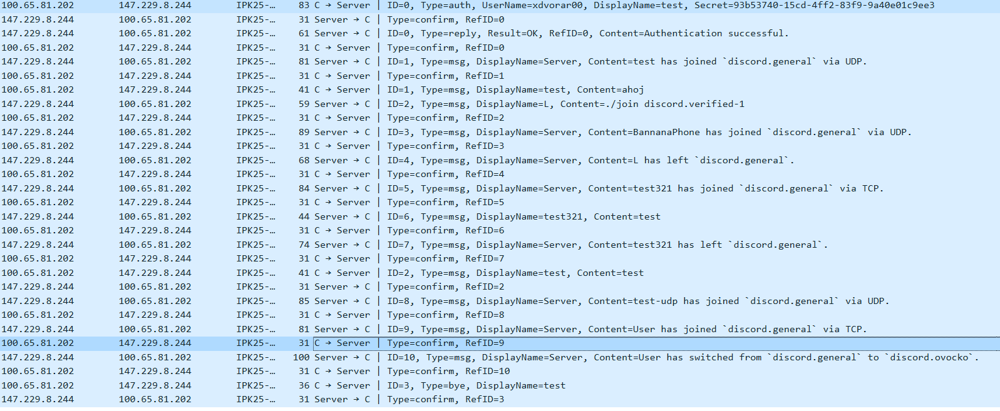

# Documentation for IPK Project 2

Author: **Radim Dvořák** (xdvorar00)\
Date: **2025-04-19**

## Table of contents

1. [Table of contents](#table-of-contents)
2. [Project summary](#project-summary)
   - [Prerequisites](#prerequisites)
3. [Usage](#usage)
4. [Design of client](#design-of-client)
   - [Extensions](#extensions)
   - [Class diagram](#class-diagram)
   - [Messenger](#messenger)
   - [TCP messenger](#tcp-messenger)
   - [UDP messenger](#udp-messenger)
   - [Input parsing](#input-parsing)
5. [Testing](#testing)
    - [Using netcat](#using-netcat)
    - [Automatic tests](#automatic-tests)
    - [Testing on reference server](#testing-on-reference-server)
      - [TCP](#tcp)
      - [UDP](#udp)
6. [Bibliography](#bibliography)

## Project summary

This project implements a client application for the IPK25-CHAT protocol.[1]\
The client is written in C++. For correct compilation the required standard is C++20.

AI models (Copilot, ChatGPT) were used to assist with writing comments. Grammatical control of documentation was performed using AI models as well.\

### Prerequisites

- GNU Make (version 4.3 works)
- G++ compiler (version 13.3.0 works)

## Usage

The client can be executed by\
``make``\
``./ipk25-chat -t udp|tcp -s domain-name | ip-address {-p port} {-d timeout} {-r retransmissions} {-h}``

- -t Transport protocol used for connection, either UDP or TCP
- -s Address of a server
  - This can be either IPv4 address of server (e.g. *147.229.8.244*)\
    or domain name (e.g. *anton5.fit.vutbr.cz*)
- -p Port to use (default is 4567)
- -d UDP confirmation timeout in milliseconds (default is 250)
- -r Maximum number of UDP retransmissions (default is 3)
- -h Prints usage information and exits

## Design of client

### Extensions

- Command
  - /exit - Graceful termination of aplication (same as SIGINT).

### Class diagram


### Messenger

Universal virtual class that defines the interface for sending and receiving messages.
It is used as a base class for both UDP and TCP messengers.

This class separates client logic from the implementation of the protocol.
All messages are processed relative to the current state of the client.

All messages are processed and stored in a queue. This guarantees that the messages sent by the user or by the server are processed in their corresponding state and order, especially if the client is waiting for a reply from the server.

Messages are received from the socket, which is read after the *poll()* function indicates that at least one of the two file descriptors were written into.

### TCP messenger

Implements the Transport Control Protocol (TCP) for the IPK25-CHAT protocol. [1]\
In this variant, the protocol is implemented via textual commands defined in grammar form.

### UDP messenger

Implements the User Datagram Protocol (UDP) for the IPK25-CHAT protocol. [1]

Messages are sent as datagrams, and the client waits for an acknowledgment from the server. If no acknowledgment is received within the specified timeout, the message is retransmitted up to the maximum number of retransmissions defined by the user.

### Input parsing

All commands from stdin are read and processed to the corresponding message, or the command is invalid, and the user is notified.

From the given command, there was implemented an extra command '/exit' that terminates the application, has the same behaviour as SIGINT signal.

## Testing

### Using netcat

In the early stages of development, the TCP messenger was tested using *netcat*.
I choose this tool to know if the state machine and input reading are working correctly. To state if the client works correctly i was using the automated tests or the reference server.

Below you can see one of the test scenarios.
The client was started with the following command:

```bash
./ipk25chat-client -t tcp -s localhost
```

Input and output of the client side is shown below:

```plaintext
/auth radim heslo jmeno
Action Success: Auth success.
server: zdravim
ahoj
/rename jmeno2 
ahoj
/join general
Action Success: Join success.
ahoj i zde
^C
```

Server was started using *netcat* with the following command:

```bash
nc -4 -C -l -v 127.0.0.1 4567
```

The server input and output is shown below:

```plaintext
Listening on localhost 4567
Connection received on localhost 37358
AUTH radim AS jmeno USING heslo
REPLY OK IS Auth success.
MSG FROM server IS zdravim
MSG FROM jmeno IS ahoj
MSG FROM jmeno2 IS ahoj
JOIN general AS jmeno2
REPLY OK IS Join success.
MSG FROM jmeno2 IS ahoj i zde
BYE FROM jmeno2
```

### Automatic tests

Later the client was tested using  automatic tests provided by a fellow student. I am grateful for the provided tests and have included a link to the repository. [2]

### Testing on reference server

#### TCP

The client was tested on the reference server using the following command:

```bash
./ipk25chat-client -t tcp -s anton5.fit.vutbr.cz
```

```plaintext
/auth xdvorar00 93b53740-15cd-4ff2-83f9-9a40e01c9ee3 test
Action Success: Authentication successful.
Server: test has joined `discord.general` via TCP.
Server: L has joined `discord.general` via TCP.
Server: test321 has joined `discord.general` via TCP.
Server: L has left `discord.general`.
test321: ahoj
Server: arstryx has joined `discord.general` via UDP.
Server: test has joined `discord.general` via TCP.
Server: test321 has left `discord.general`.
Server: x has joined `discord.general` via UDP.
arstryx: AHOJKY
ahoj
Server: yaMan has joined `discord.general` via TCP.
test: ahoj
yaMan: henlo
Server: ztracimto has joined `discord.general` via UDP.
^C
```

The conversation can be seen in the image captured from the Wireshark:


#### UDP

The testing was done with UDP protocol as well. The client was started with the following command:

```bash
./ipk25chat-client -t udp -s anton5.fit.vutbr.cz
```

```plaintext
/auth xdvorar00 93b53740-15cd-4ff2-83f9-9a40e01c9ee3 test
Action Success: Authentication successful.
Server: test has joined `discord.general` via UDP.
ahoj
L: ./join discord.verified-1
Server: BannanaPhone has joined `discord.general` via UDP.
Server: L has left `discord.general`.
Server: test321 has joined `discord.general` via TCP.
test321: test
Server: test321 has left `discord.general`.
test
Server: test-udp has joined `discord.general` via UDP.
Server: User has joined `discord.general` via TCP.
Server: User has switched from `discord.general` to `discord.ovocko`.
^C
```

The conversation can be seen in the image captured from the Wireshark:



## Bibliography

[1] IPK-Project2 [Online]. Git.fit.vutbr. 2025 [cit. 2025-04-15]. Available at: <https://git.fit.vutbr.cz/NESFIT/IPK-Projects/src/branch/master/Project_2>

[2] MALASHCHUK Vladyslav, Tomáš HOBZA, et al. VUT_IPK_CLIENT_TESTS [Online]. GitHub, 2025 [cit. 2025-04-19]. Available at: <https://github.com/Vlad6422/VUT_IPK_CLIENT_TESTS>

Dolejška, D. Programování síťových aplikací [Online]. FIT VUT, 2025. <https://moodle.vut.cz/pluginfile.php/1081875/mod_folder/content/0/IPK2024-25L-04-PROGRAMOVANI.pdf>
